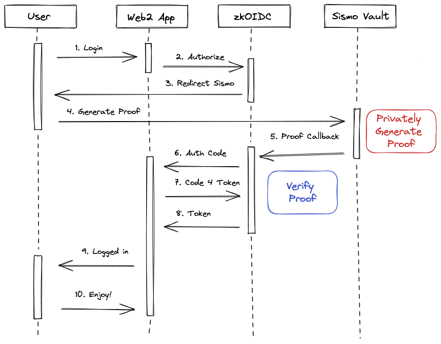

# zkOIDC
Privacy-preserving sign-in with Sismo Connect via OpenID Connect. 

An OAuth 2.0 Authorization Server supporting OpenID Connect and wrapping Sismo Connect.

## Why

[Open ID Connect](https://openid.net/) is the standard for web2 logins and identity needs. Major public identity providers like Google, Facebook and LinkedIn [support](https://openid.net/certification/) it as well as most enteprises.

This project aim to make Sismo Connect compatible with Open ID Connect enabling any app supporting it (e.g. Discourse) to offer privacy preserving logins to their users.

## How it works

It extends [oidc-provider](https://github.com/panva/node-oidc-provider), a Node.js certified OpenID Connect server, wrapping Sismo Connect login/attestation flow.

Below the typical flow, you can test it with this [simple app](https://zk-oidc-simple-app.vercel.app/).



1. The user goes to login page of the web2 app and choose the zk OIDC login method
1. The web2 app redirects the user to the OIDC authorization endpoint
1. zkOIDC checks authorization request and redirect the user to the Sismo Vault App
1. The user unlocks their vault and privately generate the proof
1. The Sismo Vault App redirects the user to zkOIDC with the generated proof
1. zkOIDC verify the proof is valid. At this step the user can be considered authenticated and the process follows the usual OAuth2 authorization code grant flow aka zkOIDC shares the auth code to the web2 app via the web2 configured callback
1. The web2 app reaches out zkOIDC asking to exchange the code for an id token
1. zkOIDC checks code and client credentials (when required), giving back the id token. The id token contains all the claims attested via Sismo Connect
1. The web2 app can login the user
1. The user can operate the web2 app

For the tech implementation, you may start reading [here](./api/index.js).

App is serverless and deployed to Vercel at https://zkoidc.xyz

## How to add my enable my web2 app

It's easy, it's like a traditional OIDC server (e.g. [Okta](https://www.okta.com/)). You just need to create your client and define the redirect URIs.

Below the process:
1. Go to the [Sismo Factory](https://factory.sismo.io/apps-explorer) and create a new app using `zkoidc.xyz` as authorized domain. Take note of your Sismo app id.
1. Fork this repo and edit the [clients.js](./config/clients.js) file adding your client details, `client_id` is your Sismo app id. For a frontend-only app, copy the zk-oidc-simple-app conf. For a app with a backend (e.g. discourse forum), copy the zk-forum one.
1. Create a PR. When merged, you can configure you app using the zkOIDC well-known for your app https://<appid>.zkoidc.xyz/oidc/.well-known/openid-configuration.

## ID Token format

This is an example of the data you will get

```
{
  "sub": "0x205af8da5dc1846f1ce538ceb56dd88154b837a9ca658abef7f6ef8760616538",
  "email": "0x205af8da5dc1846f1ce538ceb56dd88154b837a9ca658abef7f6ef8760616538@sismo.local",
  "email_verified": true,
  "family_name": "0x205af8da5dc1846f1ce538ceb56dd88154b837a9ca658abef7f6ef8760616538",
  "given_name": "0x205af8da5dc1846f1ce538ceb56dd88154b837a9ca658abef7f6ef8760616538",
  "name": "0x205af8da5dc1846f1ce538ceb56dd88154b837a9ca658abef7f6ef8760616538",
  "aud": "0xf9a3cce444b65927a9dd225d6731b341",
  "exp": 1683808779,
  "iat": 1683805179,
  "iss": "https://zkoidc.xyz/oidc"
}

```

Personal details and e-mail are derived from the Sismo Vault ID. At the moment, they are there only to provide compatibility with apps which require them.

## What's next

- Support any claim not just the login, e.g. user belong to the Sismo Group `0x<groupid>`. Useful to offer granular gated content on web2 apps.
- Make Sismo Connect compatible with [OpenID for Verifiable Credentials](https://openid.net/openid4vc/) which is the initiative for make OpenID Connect truly a SSI system.
